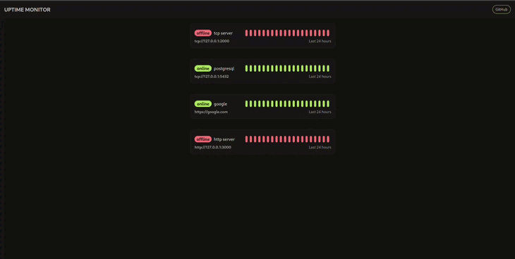

This is a simple uptime service that can handle tcp and http



# Recommended requirements

- Go version 1.20.8
- node v18.17.1
- npm v9.6.7
- Docker version 20.10.25, build v20.10.25

# Installation

```bash
git clone https://github.com/g0dm0d/uptime
cd uptime
cp ./configs/.env.example ./.env
cp ./configs/uptime.toml.example ./uptime.toml
```

Set up the configs

```bash
docker compose build
docker compose up
```